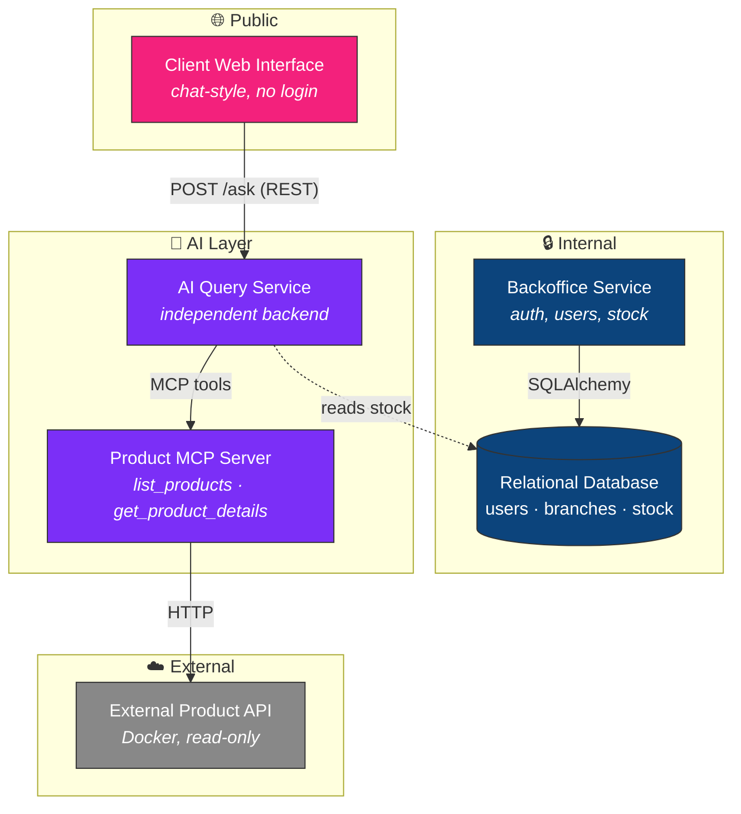
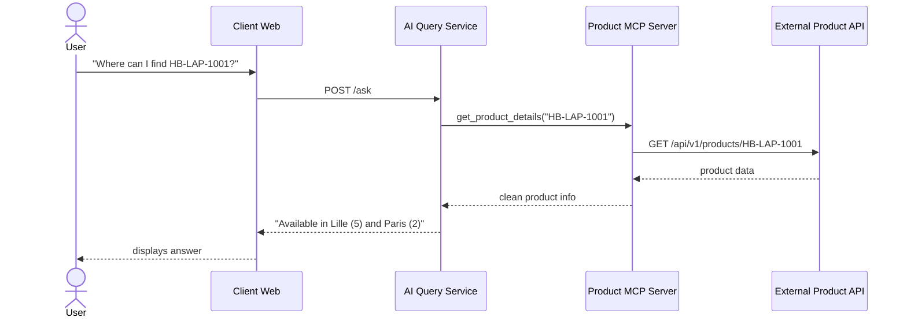

# 🏬 HBntory — Inventory Management Platform

<p align="center">
  
  
  
  
  
  
</p>

<p align="center">
  An inventory management system for a fictional multi-branch retail company,
  combining a secure Backoffice, an external product catalog, an MCP-powered
  AI agent, and a natural-language client interface.
</p>

---

## 📐 Architecture overview



**Data boundary:** product catalog data (names, prices, descriptions) always comes from the external Product API. The local database never duplicates it — it only stores the external `product_id` (the API's `sku` field) alongside branch and quantity information.

---

## 🧩 Components

| Component | Owner | Responsibility |
|---|---|---|
| **Backoffice Service** | Léo | Authenticated internal app — user & branch management, stock operations |
| **Relational Database** | Léo | Stores users, branches, stock quantities (never product details) |
| **External Product API** | Provided by school | Read-only product catalog (Docker container) |
| **Product MCP Server** | Ouarda | Bridges the AI agent to the external Product API |
| **AI Query Service** | Ouarda | Independent backend answering natural-language questions |
| **Client Web Interface** | Ouarda/Léo | Public chat page, no authentication required |

---

## 🔄 Request flow example



---

## 🛠️ Tech stack

<p align="center">
  
</p>

- **Backend:** Python, FastAPI, SQLAlchemy
- **AI / Agent layer:** Model Context Protocol (MCP)
- **Database:** relational (SQLite/PostgreSQL via SQLAlchemy)
- **Frontend:** vanilla HTML/CSS/JS (chat-style interface)
- **Infrastructure:** Docker for the external Product API

---

## 🚀 Getting started

### 1. Clone the repository
```bash
git clone https://github.com/Lunaruo/hbntory-inventory-platform.git
cd hbntory-inventory-platform/inventory-management-system
```

### 2. Start the external Product API
```bash
cd ../../hbntory-products-api
docker compose up --build
```

### 3. Start the Product MCP Server
```bash
cd inventory-management-system/product_mcp_server
python3 -m venv venv && source venv/bin/activate
pip install -r requirements.txt
python3 server.py
```

### 4. Start the AI Query Service
```bash
cd ../ai_service
python3 -m venv venv && source venv/bin/activate
pip install fastapi uvicorn httpx
uvicorn main:app --reload --port 8000
```

### 5. Open the Client Web Interface
```bash
open ../client_web/index.html
```

### 6. Start the Backoffice
See [`backoffice/README.md`](inventory-management-system/backoffice/README.md) for setup instructions.

---

## 📋 Project structure

inventory-management-system/
├── backoffice/ # Internal app — auth, users, stock (Léo)
├── ai_service/ # AI Query Service (Ouarda)
├── product_mcp_server/ # MCP bridge to the Product API (Ouarda)
├── client_web/ # Public chat interface (Ouarda)
├── docs/ # Architecture & decision documents
└── docker-compose.yml


---

## 📖 Documentation

- [AI Query Service — architecture & technical decisions](inventory-management-system/ai_service/README.md)
- [Product MCP Server](inventory-management-system/product_mcp_server/README.md)
- [Database schema](inventory-management-system/docs/database_schema.md)
- [MVP definition](inventory-management-system/docs/mvp.md)

---

## 👥 Team

| | |
|---|---|
| **Léo Lebtahi** | Backoffice — database, authentication, stock management, Client Web Interface |
| **Ouarda Bouchema** | AI/MCP layer — Product MCP Server, AI Query Service, Client Web Interface |

---

<p align="center"><i>HBntory — Holberton School project, Cohort C#29</i></p>