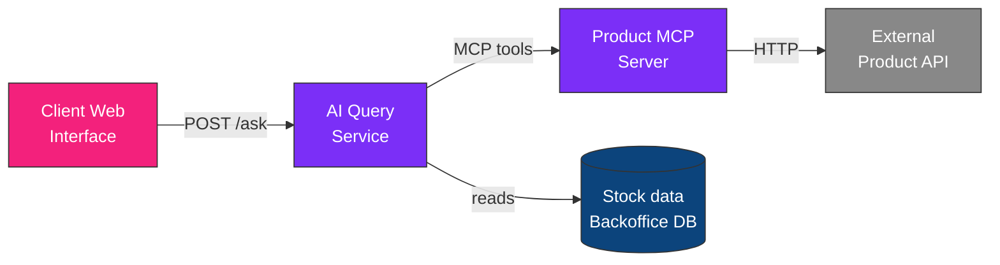
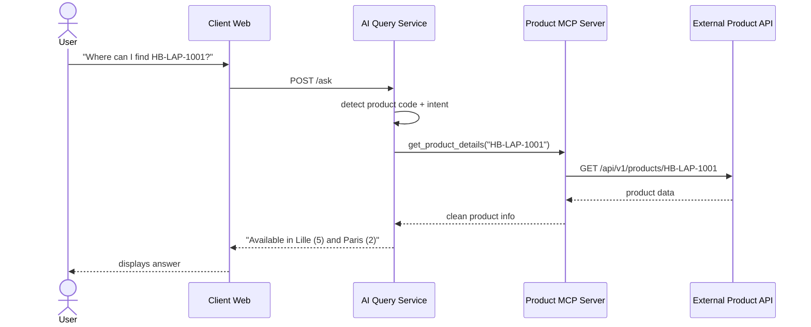

# AI Query Service — HBntory

<p align="center">
  
  
  
  
  
</p>

<p align="center">
  <i>An independent backend service that turns natural-language questions into<br/>
  grounded answers about products and stock — never invented, always sourced.</i>
</p>

---

## Table of contents

- [What this service does](#what-this-service-does)
- [Architecture](#architecture)
- [Request flow](#request-flow)
- [Technical decisions & justifications](#technical-decisions--justifications)
- [Supported questions](#supported-questions)
- [Getting started](#getting-started)
- [API reference](#api-reference)
- [Current limitations](#current-limitations)

---

## What this service does

This service is the "brain" of HBntory's public assistant. It sits between the **Client Web Interface** and two data sources — the **Product MCP Server** and the **Backoffice database** — and turns a plain-English question into a clear, honest answer.

| It does | It does NOT |
|---|---|
| Answer using real product data via MCP | Invent product names, prices, or stock |
| Clearly say when it doesn't know | Guess or hallucinate an answer |
| Stay independent from the Backoffice codebase | Share application logic with it |
| Expose a single, simple REST endpoint | Require a persistent connection |

---

## Architecture



This service is **intentionally independent** from the Backoffice, as required by the project. It shares no application code with it — it only consumes the Product MCP Server tools, and reads (read-only) the Backoffice's stock data directly from its SQLite database.

---

## Request flow



---

## Technical decisions & justifications

<details>
<summary><b>1. Why REST instead of WebSockets</b></summary>
<br/>

We chose **REST** for communication between the Client Web Interface and this service.

**Justification:**
- Each question is independent — no need for conversation history or a persistent connection.
- REST is simpler to implement, test, and debug: one `curl` command verifies the endpoint.
- WebSockets would add connection-lifecycle complexity with no functional benefit here.

**Trade-off accepted:** no real-time word-by-word streaming. Acceptable since the project doesn't require a live-typing effect.
</details>

<details>
<summary><b>2. Why the Product MCP Server is a separate component</b></summary>
<br/>

Rather than calling the external Product API directly, we built a dedicated MCP server exposing two tools: `list_products` and `get_product_details`.

**Justification:**
- Matches the project requirement: the AI agent accesses product data *only* through an MCP server.
- Clear separation of concerns — the MCP server handles the external API's errors (timeouts, 404s, connection failures); this service focuses purely on interpreting questions.
- If the external API changes, only `product_mcp_server/product_tools.py` needs updating.
</details>

<details>
<summary><b>3. How the agent accesses stock information</b></summary>
<br/>

This service queries the Backoffice's SQLite database directly (read-only), joining the `stock` and `branches` tables to return quantities per branch for a given `product_id`. This keeps a clear separation of concerns: the Backoffice owns and writes stock data (via its own models), while this service only reads it to answer questions.
</details>

<details>
<summary><b>4. Why product identifiers use the external API's <code>sku</code> field</b></summary>
<br/>

The external Product API returns both a numeric `id` and an alphanumeric `sku` (e.g. `HB-LAP-1001`).

**Justification:** the `sku` is the stable, human-readable identifier used throughout the API's documentation and search — using it avoids ambiguity and matches how users naturally reference products.
</details>

<details>
<summary><b>5. Why keyword matching instead of a full language model</b></summary>
<br/>

The current implementation looks for a product code pattern (`HB-...`) and keywords (e.g. "stock", "où", "trouver") rather than using an LLM to interpret free-form questions.

**Justification:** keeps the service simple, fast, predictable, and free of external costs — while still satisfying all mandatory question types. A true language-understanding layer is a listed future improvement.
</details>

---

## Supported questions

| Type | Example | Status |
|---|---|---|
| Product details | *"give me the details for product HB-LAP-1001"* | Done |
| Stock availability | *"where can I find product HB-LAP-1001"* | Done |
| Product listing | *"what products are available?"* | Done |
| Shopping list (multi-product) | *"I want 3 units of X and 2 of Y, which branch?"* | Done |

---

## Getting started

### 1. Install dependencies
```bash
cd inventory-management-system/ai_service
python3 -m venv venv
source venv/bin/activate
pip install -r requirements.txt
```

### 2. Make sure the Product API and MCP server are reachable
See [`product_mcp_server/README.md`](../product_mcp_server/README.md).

### 3. Make sure the Backoffice database is initialized
This service reads directly from the Backoffice's SQLite database. See [`backoffice/README.md`](../backoffice/README.md) to initialize it with sample data.

### 4. Run the service
```bash
uvicorn main:app --reload --port 8000
```
Available at `http://localhost:8000`

---

## API reference

### `POST /ask`

**Request:**
```json
{ "question": "give me the details for product HB-LAP-1001" }
```

**Response (success):**
```json
{
  "success": true,
  "answer": "Product Holberton Student Laptop 14 is priced at 799.0 USD. ..."
}
```

**Response (not found / unsupported):**
```json
{
  "success": false,
  "answer": "Product not found."
}
```

### CORS
CORS is enabled (`allow_origins=["*"]`) so the Client Web Interface — opened as a local HTML file — can reach this service from the browser. In production this would be scoped to the actual client domain.

---

## Current limitations

| Limitation | Plan |
|---|---|
| Keyword-based question matching | Consider a language-understanding layer if time allows |
| No conversation history | Not required by the project; possible future improvement |

---

<p align="center"><i>Part of the HBntory Inventory Management Platform — Holberton School, Cohort C#29</i></p>
