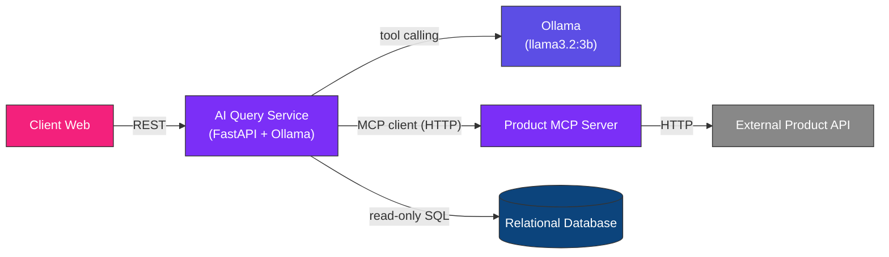

# AI Query Service — HBntory

<p align="center">
  
  
  
  
</p>

<p align="center">
  <i>A real AI agent — powered by Ollama — that decides which tool to call,<br/>
  connects to a real MCP server over HTTP, and never invents an answer.</i>
</p>

---

## What this service does

This service is the "brain" of HBntory's public assistant. A genuine AI agent (not keyword matching) receives the question, decides which tool to use, and writes the final answer.

| It does | It does NOT |
|---|---|
| Uses **Ollama** (local LLM) to understand the question | Match keywords with `if/else` logic |
| Calls a **real MCP server** over HTTP for product info | Import product functions directly in Python |
| Queries the database directly (read-only) for stock | Invent product names, prices, or quantities |
| Politely refuses off-topic or invalid questions | Guess a category from a plain-language product name |

---

## Architecture



---

## How the agent works

1. The question is checked against a lightweight filter (contains a product code, or a relevant keyword like "produit", "stock"). Off-topic questions are answered directly without involving the LLM.
2. The question is sent to **Ollama** (`llama3.2:3b`) along with a list of available tools (`list_products`, `get_product_details`, `get_stock`).
3. Ollama decides — on its own — whether to answer directly or request a tool call.
4. If a tool is requested, the service executes it for real:
   - `list_products` / `get_product_details` → call the **Product MCP Server** through a real MCP client (`fastmcp.Client`), over HTTP.
   - `get_stock` → a direct read-only SQL query against the local database.
5. The tool's result is sent back to Ollama, which writes the final natural-language answer in French.

---

## Technical decisions & justifications

<details>
<summary><b>1. Why a real agent (Ollama) instead of keyword matching</b></summary>
<br/>

**Justification:** an AI agent must genuinely understand the question and decide which capability to use — that decision belongs to the model, not to hardcoded `if` conditions. Ollama runs locally, is free, and supports native tool calling, which lets it request exactly the tool it needs with the right arguments.
</details>

<details>
<summary><b>2. Why a real MCP client/server connection over HTTP</b></summary>
<br/>

**Justification:** the project requires the AI agent to access product information *through* an MCP server, not by importing its functions directly. The Product MCP Server runs as an independent HTTP service (`streamable-http` transport), and this service connects to it as a genuine remote client (`fastmcp.Client`), calling `list_products_tool` and `get_product_details_tool` over the network.
</details>

<details>
<summary><b>3. Why stock is read directly, not through MCP</b></summary>
<br/>

**Justification:** the stock data lives in the same project's relational database, not behind an external API — a direct, read-only SQL query is simpler and equally safe, since the AI agent never writes to the database.
</details>

<details>
<summary><b>4. Why a lightweight pre-filter before calling the LLM</b></summary>
<br/>

**Justification:** small local models occasionally produce malformed or empty responses on completely unrelated questions (e.g. "what's the weather"). A simple check — does the question mention a product code or a relevant keyword — avoids wasting a model call on clearly out-of-scope questions and guarantees a stable, honest fallback answer.
</details>

<details>
<summary><b>5. Why product identifiers use the external API's <code>sku</code> field</b></summary>
<br/>

**Justification:** the `sku` (e.g. `HB-LAP-1001`) is the stable, human-readable identifier used throughout the API and the local stock table — using it avoids ambiguity and matches how users naturally reference products.
</details>

---

## Supported questions

| Type | Example | Status |
|---|---|---|
| Product details | *"quel est le prix du HB-LAP-1001"* | Done |
| Stock availability | *"où trouver le produit HB-LAP-1001"* | Done |
| Product listing | *"liste des produits"* | Done |
| Shopping list (multi-product) | *"où trouver HB-LAP-1001 et HB-LAP-1002"* | Done |
| Off-topic / invalid product | *"quelle est la météo"*, *"une échelle"* | Handled honestly, no invention |

---

## Getting started

### Locally (outside Docker)

```bash
cd inventory-management-system/ai_service
python3 -m venv venv
source venv/bin/activate
pip install -r requirements.txt
```

Make sure the following are running first:
- **Ollama**, with the model pulled: `ollama pull llama3.2:3b`
- **Product MCP Server**, in HTTP mode (`python3 server.py` in `product_mcp_server/`)

Then run:
```bash
cd inventory-management-system
uvicorn ai_service.main:app --reload --port 8000
```

### With Docker Compose

```bash
cd inventory-management-system
docker compose up --build
```

Ollama must still be running on the host machine — the container reaches it via `host.docker.internal`.

---

## Environment variables

| Variable | Default | Purpose |
|---|---|---|
| `MCP_SERVER_URL` | `http://127.0.0.1:8001/mcp` | Address of the Product MCP Server |
| `OLLAMA_MODEL` | `llama3.2:3b` | Model used for the agent |
| `OLLAMA_HOST` | `http://host.docker.internal:11434` | Address of the Ollama server |

---

## API reference

### `POST /ask`

**Request:**
```json
{ "question": "où trouver le produit HB-LAP-1001" }
```

**Response (success):**
```json
{
  "success": true,
  "answer": "Le produit HB-LAP-1001 est disponible dans les magasins de Paris et Lille, avec une quantité de 15 et 6 unités respectivement."
}
```

**Response (error):**
```json
{
  "success": false,
  "answer": "Une erreur est survenue: ..."
}
```

### CORS
CORS is enabled (`allow_origins=["*"]`) so the Client Web Interface can reach this service from the browser.

---

## Current limitations

| Limitation | Note |
|---|---|
| Small local models can occasionally misformat tool calls | Mitigated with response format normalization and fallback messages |
| Some seeded stock `product_id` values don't exist in the external Product API | Data inconsistency between test datasets, documented for transparency |
| No conversation history between requests | Each question is handled independently, matching the REST design choice |

---

<p align="center"><i>Part of the HBntory Inventory Management Platform — Holberton School, Cohort C#29</i></p>