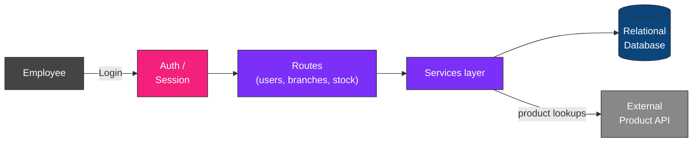

# Backoffice — HBntory

<p align="center">
  
  
  
  
  
</p>

<p align="center">
  <i>The employee-facing application for HBntory — authentication, user management,<br/>
  branch management, and stock operations, all behind a role-based access control.</i>
</p>

---

## Table of contents

- [What this service does](#what-this-service-does)
- [Architecture](#architecture)
- [Roles & permissions](#roles--permissions)
- [Technical decisions & justifications](#technical-decisions--justifications)
- [Project structure](#project-structure)
- [Getting started](#getting-started)
- [Routes reference](#routes-reference)
- [Current limitations](#current-limitations)

---

## What this service does

The Backoffice is the internal web application used only by authenticated employees to manage users, branches, and stock.

| It does | It does NOT |
|---|---|
| Authenticate employees via session-based login | Store product information locally |
| Enforce role-based access (Admin / Common User) | Allow common users to touch other branches' stock |
| Manage users, branches, and stock quantities | Allow admins to modify stock directly |
| Hash and protect all passwords | Ever store passwords in plain text |
| Prevent stock from going negative | Duplicate data already owned by the Product API |

---

## Architecture



The Backoffice never stores product names, prices, or descriptions — it only keeps the external `product_id` alongside stock quantities, and looks up product details from the external Product API when needed.

---

## Roles & permissions

| Action | Admin | Common User |
|---|---|---|
| Log in / log out | Yes | Yes |
| Create / modify / soft-delete users | Yes | No |
| Change passwords | Yes | Own password only |
| Assign users to branches | Yes | No |
| Manage branches | Yes | No |
| Add / remove stock | No | Own branch only |
| View stock | Yes (all branches) | Own branch only |

Authorization is enforced server-side on every route — not just hidden in the UI — since a user could otherwise send a request directly and bypass a hidden button.

---

## Technical decisions & justifications

<details>
<summary><b>1. Session-based authentication (not token/JWT)</b></summary>
<br/>

**Justification:** the Backoffice is a traditional server-rendered web application (Flask + Jinja templates), where the browser and server maintain a stateful relationship page after page. A session cookie fits this pattern naturally, without the added complexity of issuing, storing, and refreshing tokens on the client side.

**Trade-off accepted:** less convenient for a fully decoupled API client (e.g. a mobile app), but the Backoffice has no such requirement.
</details>

<details>
<summary><b>2. Passwords hashed with Werkzeug security</b></summary>
<br/>

**Justification:** passwords are never stored or compared in plain text. `generate_password_hash` / `check_password_hash` from Werkzeug provide a standard, well-tested hashing scheme (scrypt) without needing an extra dependency, since Flask already depends on Werkzeug.
</details>

<details>
<summary><b>3. Product information is never duplicated locally</b></summary>
<br/>

**Justification:** only the external `product_id` (a string, matching the Product API's `sku`) is stored alongside stock entries. Product names, prices, and descriptions are always fetched live from the external Product API when needed, keeping the Product API as the single source of truth and avoiding data drift between the two systems.
</details>

<details>
<summary><b>4. Soft-delete for users, never permanent deletion</b></summary>
<br/>

**Justification:** deactivating a user (`is_active = False`) instead of deleting their row preserves historical stock movement records tied to that user, and allows reactivation later without recreating the account.
</details>

---

## Project structure

```
backoffice/
├── app/            # Flask application factory and configuration
├── database/       # Engine setup and database initialization (init_db, seed data)
├── models/         # SQLAlchemy models: User, Branch, Stock
├── routes/         # Route blueprints (auth, users, branches, stock)
├── services/       # Business logic layer (e.g. product lookups via the Product API)
├── templates/      # Jinja2 HTML templates (login, dashboards, forms)
├── Dockerfile
├── requirements.txt
└── README.md
```

---

## Getting started

### 1. Install dependencies
```bash
cd inventory-management-system/backoffice
python3 -m venv venv
source venv/bin/activate
pip install -r requirements.txt
```

### 2. Initialize the database
```bash
cd ..
python3 -m backoffice.database.init_db
```
This creates `inventory.db` with the schema, branches, an admin account, and sample stock data.

### 3. Run the application
```bash
cd backoffice
flask --app app run --debug
```

---

## Routes reference

| Route | Method | Access | Description |
|---|---|---|---|
| `/login` | GET, POST | Public | Log in with username and password |
| `/logout` | POST | Authenticated | End the current session |
| `/users` | GET | Admin | List all users |
| `/users` | POST | Admin | Create a new user |
| `/users/<id>` | PUT | Admin | Modify a user |
| `/users/<id>` | DELETE | Admin | Soft-delete a user |
| `/branches` | GET, POST | Admin | List / create branches |
| `/stock` | GET | All roles | View stock (own branch for Common Users) |
| `/stock` | POST | Common User | Add or remove stock for their branch |

*(Exact route paths may differ slightly — see `routes/` for the source of truth.)*

---

## Current limitations

| Limitation | Plan |
|---|---|
| No automated tests yet | Optional feature, time permitting |
| No password reset flow | Not required by the project scope |
| No audit log of stock changes | Optional feature, time permitting |

---

<p align="center"><i>Part of the HBntory Inventory Management Platform — Holberton School, Cohort C#29</i></p>
