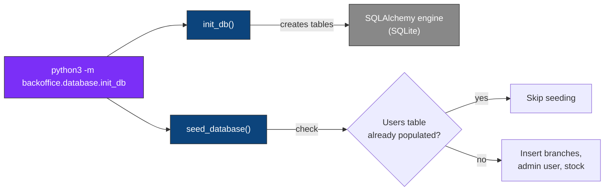

# Database — HBntory Backoffice

<p align="center">
  
  
  
</p>

<p align="center">
  <i>Database engine setup and initialization for the HBntory Backoffice —<br/>
  creates the schema and seeds it with sample data for local development.</i>
</p>

---

## Table of contents

- [What this module does](#what-this-module-does)
- [Files](#files)
- [How it works](#how-it-works)
- [Getting started](#getting-started)
- [Seeded data](#seeded-data)
- [Technical decisions & justifications](#technical-decisions--justifications)
- [Current limitations](#current-limitations)

---

## What this module does

This module owns everything related to connecting to and initializing the Backoffice's local relational database.

| It does | It does NOT |
|---|---|
| Create the SQLAlchemy engine and session factory | Store product names, prices, or descriptions |
| Create all tables from the SQLAlchemy models | Modify data outside the three core tables |
| Seed the database with sample branches, an admin user, and stock | Run automatically in production |
| Guard against re-seeding an already-initialized database | Validate data against the external Product API |

---

## Files

| File | Purpose |
|---|---|
| `database.py` | Defines `DATABASE_URL`, the SQLAlchemy `engine`, the `SessionLocal` session factory, and `init_db()` to create all tables. |
| `init_db.py` | Runs `init_db()` and calls `seed_database()` to populate the database with sample branches, an admin account, and stock entries — skips seeding if data already exists. |

---

## How it works



`init_db()` creates the database file and all tables (`branches`, `users`, `stock`) based on the SQLAlchemy models in `../models/`. `seed_database()` then inserts sample data — but only if the `users` table is empty, so running the script again is always safe and never duplicates data.

---

## Getting started

Run from the `inventory-management-system/` directory (not from inside `backoffice/`), so the `backoffice` package can be resolved correctly:

```bash
cd inventory-management-system
python3 -m backoffice.database.init_db
```

This creates `inventory.db` at the root of `inventory-management-system/`.

To start over with a clean database:
```bash
rm inventory-management-system/inventory.db
python3 -m backoffice.database.init_db
```

---

## Seeded data

Running the script creates:

| Branch | Sample stock (product_id, quantity) |
|---|---|
| Paris | HB-LAP-1001 (15), HB-KBD-3001 (10), HB-MSE-4001 (20), HB-USB-5001 (35), HB-WEB-7001 (8) |
| Lille | HB-LAP-1001 (6), HB-LAP-1002 (7), HB-MON-2001 (12), HB-HDP-8001 (18), HB-CAM-9001 (6), HB-CHA-10001 (14), HB-USB-5001 (18) |

Plus one admin account (`admin` / hashed password, no branch assignment).

---

## Technical decisions & justifications

<details>
<summary><b>1. SQLite as the database engine</b></summary>
<br/>

**Justification:** SQLite requires no separate server process, making local development and testing simple — a single file (`inventory.db`) holds the entire database. This fits the project's scope, where the database only needs to store a small set of local records (users, branches, stock).
</details>

<details>
<summary><b>2. Seeding guarded by a check on the Users table</b></summary>
<br/>

**Justification:** checking `if session.query(User).first()` before seeding prevents duplicate branches, users, or stock entries if the script is run more than once — for example after a fresh `git pull` or when a teammate re-runs setup instructions.
</details>

<details>
<summary><b>3. product_id stored as a string</b></summary>
<br/>

**Justification:** the external Product API identifies products with alphanumeric SKUs (e.g. `HB-LAP-1001`), not numeric IDs — the `product_id` column matches this format so stock entries can be reliably linked to real products.
</details>

---

## Current limitations

| Limitation | Note |
|---|---|
| Some seeded `product_id` values do not exist in the external Product API | Sample data was created independently from the API catalog; only a subset of product IDs currently match both sources |
| No migration system (e.g. Alembic) | Schema changes currently require dropping and recreating the database |

---

<p align="center"><i>Part of the HBntory Inventory Management Platform — Holberton School, Cohort C#29</i></p>
