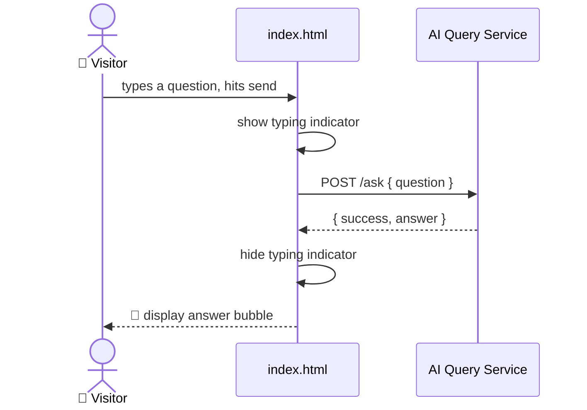

#  Client Web Interface — HBntory

<p align="center">
  
  
  
  
  
</p>

<p align="center">
  <i>A simple, public chat interface where anyone can ask questions about<br/>
  HBntory's products and stock — no login required.</i>
</p>

---

##  Table of contents

- [What this is](#-what-this-is)
- [How it works](#-how-it-works)
- [Getting started](#-getting-started)
- [Example questions](#-example-questions)
- [Design decisions](#-design-decisions)
- [File structure](#-file-structure)

---

##  What this is

A single self-contained HTML page (`index.html`, no build step, no framework) providing a chat-style interface. Visitors type a question, the page sends it to the **AI Query Service**, and displays the answer — with a typing indicator while waiting and a clear error message if the service is unreachable.

| Feature | Included |
|---|---|
| Text input + send button | ✅ |
| Chat-style message bubbles | ✅ |
| "Typing..." indicator while waiting | ✅ |
| Clickable question suggestions | ✅ |
| Graceful error handling | ✅ |
| Authentication | ❌ (not required — public interface) |

---

##  How it works



The page communicates with the AI Query Service over **REST** (see [`ai_service/README.md`](../ai_service/README.md) for the justification), using a plain `fetch()` call — no external libraries required.

---

##  Getting started

### 1. Make sure the AI Query Service is running
```bash
cd ../ai_service
source venv/bin/activate
uvicorn main:app --reload --port 8000
```

### 2. Open the page
```bash
open index.html
```
No server, no build tools, no dependencies — it's a single static file.

> ⚠️ The service URL is hardcoded to `http://localhost:8000/ask` in `index.html`. Update the `API_URL` constant at the top of the `<script>` section if the service runs elsewhere.

---

##  Example questions

Try these directly in the chat, or click the suggestion chips:

- *"give me the details for product HB-LAP-1001"*
- *"where can I find product HB-LAP-1001"*
- *"what products are available?"*

---

##  Design decisions

<details>
<summary><b>Why a single static HTML file, no framework</b></summary>
<br/>

**Justification:** the project explicitly states visual polish is not the priority, and a chat interface with a text input, a submit button, and a response area doesn't need a build pipeline. A single file is trivial to open, review, and grade — no `npm install`, no bundler.
</details>

<details>
<summary><b>Why CORS had to be enabled on the AI Query Service</b></summary>
<br/>

**Justification:** this page is opened directly as a local file (`file://`), which browsers treat as a different origin than `http://localhost:8000`. Without CORS enabled on the service side, the browser blocks the request for security reasons. See [`ai_service/README.md`](../ai_service/README.md) for details.
</details>

<details>
<summary><b>Why a typing indicator and explicit error states</b></summary>
<br/>

**Justification:** the project requires basic loading feedback and clear error messages when the service fails — both are implemented here so the visitor always understands what's happening, even if the AI Query Service is slow or down.
</details>

---

##  File structure

client_web/
└── index.html # everything: markup, styles, and JS in one file
---

<p align="center"><i>Part of the HBntory Inventory Management Platform — Holberton School, Cohort C#29</i></p>