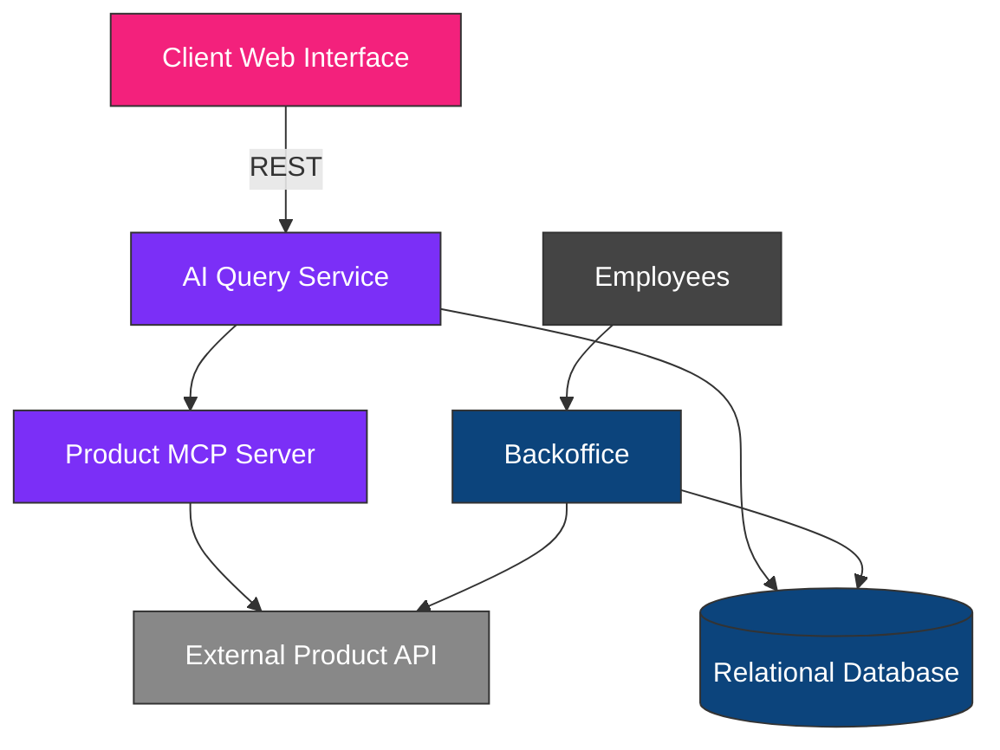
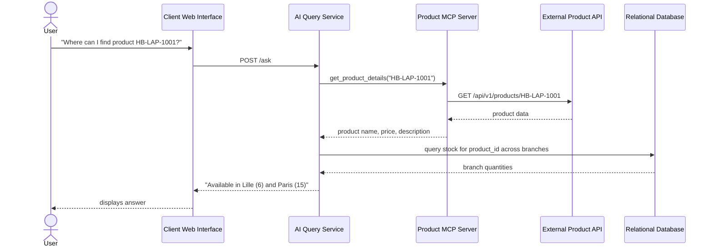

# System Architecture

## Overview

The Inventory Management System is composed of several independent services that work together to provide inventory management for employees and natural language product search for customers.

The system separates responsibilities into dedicated components:

- Backoffice Service
- Relational Database
- External Product API
- Product MCP Server
- AI Query Service
- Client Web Interface

This architecture follows a modular approach, making each component easier to maintain, test, and extend.

---

## System Components

### 1. Backoffice Service

The Backoffice is a web application used only by authenticated employees.

Its responsibilities are:

- Authenticate users.
- Manage users (administrator only).
- Manage branch stock.
- Enforce role-based permissions.
- Communicate with the relational database.
- Retrieve product information from the Product API when necessary.

The Backoffice never stores product information locally. It only stores product identifiers associated with stock quantities.

### 2. Relational Database

The relational database stores all local business data required by the application.

It contains:

- Users
- Password hashes
- User roles
- Branches
- Stock quantities
- Product IDs associated with each stock entry

The database does not store:

- Product names
- Product descriptions
- Product prices
- Product images
- Product metadata

Those data always come from the external Product API.

### 3. External Product API

The Product API is an external read-only service provided as a Docker container.

It is responsible for providing:

- Product list
- Product details

**Concrete integration details (validated):**

- Repository: `hbntory-products-api-main` (separate repo, run independently via `docker compose up --build` from its own directory).
- Local access (host machine, e.g. for the Backoffice or manual testing): `http://localhost:5001`
- Access from inside the HBntory Docker Compose network (e.g. from `product_mcp_server`): `http://external-products-api:5000` (service name `external-products-api`, internal port `5000`, per that repo's own `docker-compose.yml`).
- Endpoints used: `GET /health`, `GET /api/v1/products`, `GET /api/v1/products/{id_or_sku}`.
- Response shape confirmed: `{"count": <int>, "limit": <int>, "offset": <int>, "results": [...]}` for lists, and a flat product object (with a nested `supplier` object) for a single product.
- Robustness testing supported via `?simulate_delay_ms=750` and `?force_error=true` query parameters — used to validate our timeout/error handling in `product_mcp_server/product_tools.py`.

### 4. Product MCP Server

The Product MCP Server acts as an intermediary between the AI Query Service and the external Product API.

Its responsibilities are:

- Retrieve the complete product list.
- Retrieve detailed information for a product.
- Hide implementation details of the Product API from the AI agent.
- Expose controlled tools that can safely be used by AI agents.

This layer makes it possible to replace or modify the Product API in the future without changing the AI system.

### 5. AI Query Service

The AI Query Service processes natural-language questions coming from public users.

Its responsibilities are:

- Receive user questions.
- Determine which tools are required.
- Query the Product MCP Server for product information.
- Query stock information directly from the relational database (read-only).
- Generate natural language answers.
- Avoid inventing information when data is unavailable.

The AI service is completely independent from the Backoffice codebase.

### 6. Client Web Interface

The Client Web Interface is the public application accessible without authentication.

Users can ask questions such as:

- Which branch has product X?
- What products are available in branch Y?
- Show me details about product X.
- Which branch has enough stock for my shopping list?

The interface only communicates with the AI Query Service.

---

## Communication Between Services

**Client-side communication:** the Client Web Interface communicates with the AI Query Service using **REST**. This choice was made because each question is treated independently — there is no requirement to maintain conversation history or an open connection between requests, so REST keeps the implementation simple to build, test, and debug.

---

## Example Request Flow

---

## Local Data Storage

The application stores the following information locally:

| Data | Stored Locally |
|---|---|
| Users | Yes |
| Password hashes | Yes |
| Roles | Yes |
| Branches | Yes |
| Stock quantities | Yes |
| Product IDs | Yes |

## External Data

The following information is retrieved from the Product API:

| Data | Source |
|---|---|
| Product names | Product API |
| Product descriptions | Product API |
| Product prices | Product API |
| Product images | Product API |
| Product metadata | Product API |

No product information is duplicated in the local database.

---

## AI Data Access

The AI agent accesses information through dedicated tools, never by inventing data.

**For product information:**

AI Agent → Product MCP Server → External Product API

**For stock information:**

AI Agent → Direct read-only database query → Relational Database

This design ensures that:

- Product information always comes from the official Product API.
- Stock information always comes from the local database.
- The AI agent does not access external services directly.
- The AI agent only uses controlled tools exposed by the MCP server, plus a read-only query path for stock.

---

## Architecture Summary

This architecture separates the application into independent services with clearly defined responsibilities.

- The **Backoffice** manages users and stock.
- The **Product API** remains the only source of product information.
- The **Product MCP Server** provides secure access to product data for the AI system.
- The **AI Query Service** combines product information and stock information to answer user questions, and communicates with the Client Web Interface over REST.
- The **Client Web Interface** offers a simple natural-language interface without requiring authentication.

This modular design improves maintainability, scalability, and allows each component to evolve independently while respecting the project requirements.