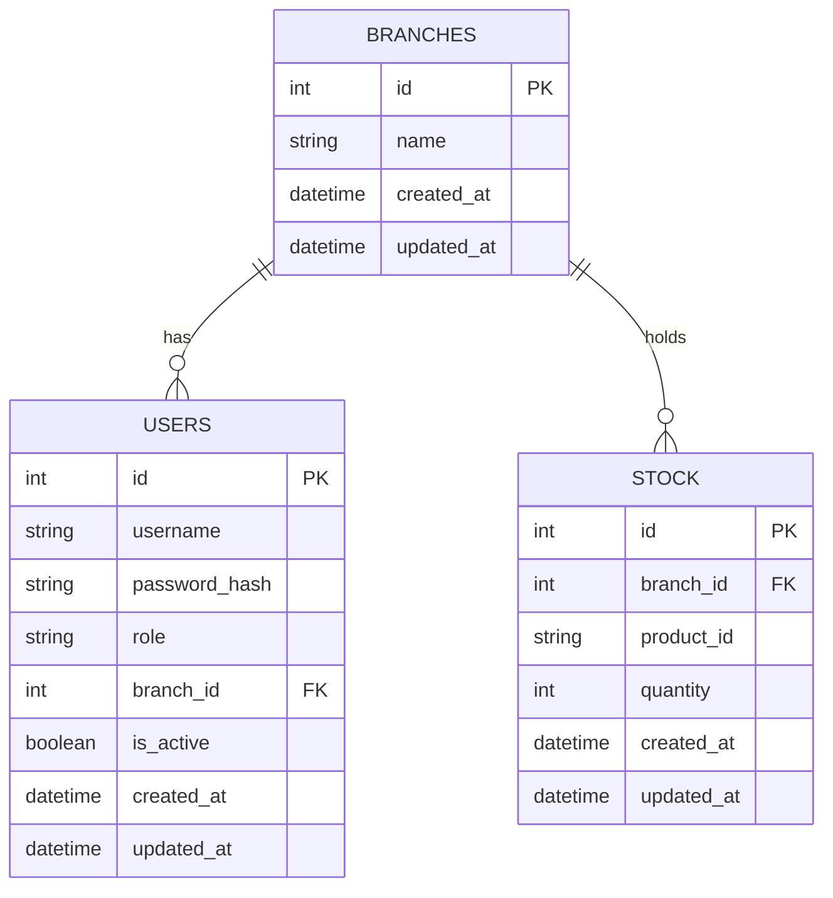

# Database Schema

## Overview

The Backoffice database stores only local application data. It manages:

- Users
- Branches
- Stock quantities

Product information is **not stored** locally. The application only stores the external product identifier (`product_id`) returned by the Product API.

---

## Entity Relationship Diagram

---

## Tables

### Users

Stores authenticated Backoffice users.

| Column | Type | Description |
|---|---|---|
| id | Integer | Primary key |
| username | String | Unique username |
| password_hash | String | Secure password hash |
| role | Enum(admin, user) | User role |
| branch_id | Foreign Key | Assigned branch (NULL for admin) |
| is_active | Boolean | Soft delete flag |
| created_at | DateTime | Creation timestamp |
| updated_at | DateTime | Last update timestamp |

**Rules:**

- Every common user belongs to exactly one branch.
- The administrator has no branch assignment.
- Users are never permanently deleted (soft delete via `is_active`).
- Passwords are stored as hashes, never in plain text.

---

### Branches

Stores company branches.

| Column | Type | Description |
|---|---|---|
| id | Integer | Primary key |
| name | String | Branch name |
| created_at | DateTime | Creation timestamp |
| updated_at | DateTime | Last update timestamp |

**Rules:**

- A branch can have multiple users.
- A branch can contain multiple stock entries.

---

### Stock

Stores product quantities available in each branch.

| Column | Type | Description |
|---|---|---|
| id | Integer | Primary key |
| branch_id | Foreign Key | Branch owning the stock |
| product_id | **String** | Product identifier from the Product API (matches the API's `sku` field, e.g. `HB-LAP-1001`) |
| quantity | Integer | Available quantity |
| created_at | DateTime | Creation timestamp |
| updated_at | DateTime | Last update timestamp |

**Rules:**

- Product information is never stored locally — only the external product identifier.
- `product_id` is a **string**, not an integer: the Product API identifies products with alphanumeric SKUs (e.g. `HB-LAP-1001`), not numeric IDs.
- Quantity must never become negative.

---

## Relationships

Branch (1) ----- (N) Users
Branch (1) ----- (N) Stock
- One branch can have many users.
- One branch can contain many stock entries.

---

## Local vs External Data

| Stored locally | Comes from the Product API |
|---|---|
| Users | Product names |
| Password hashes | Product descriptions |
| Roles | Product prices |
| Branches | Product images |
| Stock quantities | Product metadata |
| Product identifiers (`product_id`) | |

The Backoffice database never stores product names, descriptions, prices, images, or metadata — the external Product API is the single source of truth for that information.

---

## Validation Rules

The application must enforce the following business rules:

- Stock quantity cannot become negative.
- Stock operations require positive integer quantities.
- Users must belong to an existing branch (except the admin, who has none).
- Product identifiers must exist in the external Product API before stock is created for them.

---

## Design Decisions

The database intentionally contains only three tables: **Users**, **Branches**, and **Stock**. This keeps the design simple while satisfying all project requirements.

Product information is intentionally excluded from the database because the external Product API is the single source of truth for product data. Duplicating it locally would violate the project's data boundary requirement and create a risk of the two sources going out of sync.

`product_id` is stored as a string (not an integer) specifically because it must match the Product API's `sku` format (e.g. `HB-LAP-1001`), which is alphanumeric — this is the identifier the AI Query Service and the Product MCP Server also use to reference products consistently across the whole system.